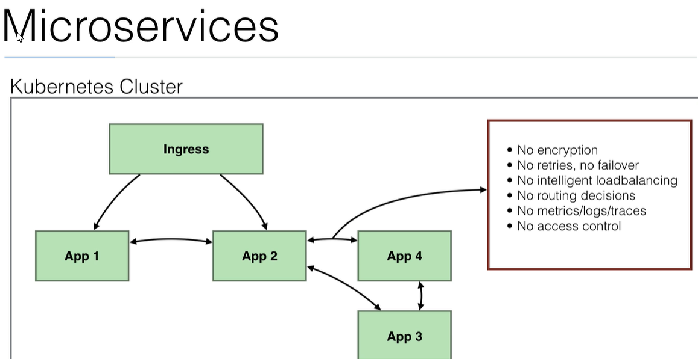
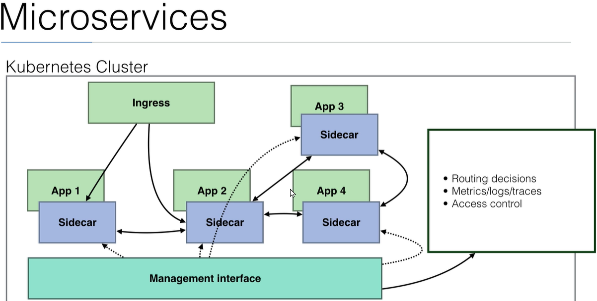
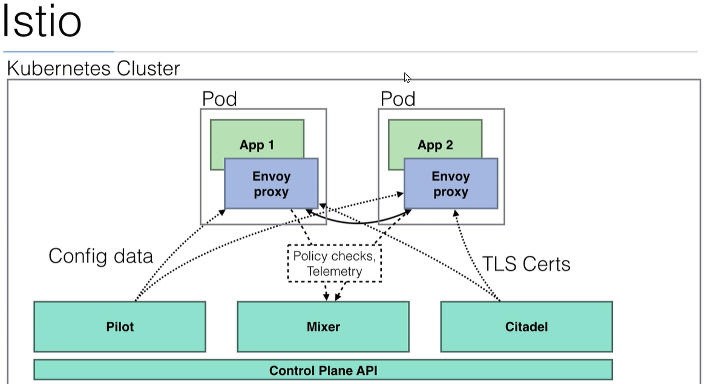

# Learn DevOps: The Complete Kubernetes Course

## Section 10 Microservices

### Ch 120 Introduction istio





```bash
## not working on arm64 : FAIL
 curl -L https://istio.io/downloadIstio | ISTIO_VERSION=1.9.1 TARGET_ARCH=arm64 sh -
 sudo ./istio-1.9.1/bin/istioctl install --set profile=demo -y --kubeconfig /etc/rancher/k3s/k3s.yaml
```

```bash
## on docker desktop wsl2
curl -L https://istio.io/downloadIstio | sh -
istio-1.9.1/bin/istioctl install --set profile=demo -y
kubectl label namespace istio-tests istio-injection=enabled
kubectl apply -f samples/bookinfo/platform/kube/bookinfo.yaml -n istio-tests
kubectl get services -n istio-tests
kubectl get pods -n istio-tests

kubectl exec "$(kubectl get pod -l app=ratings -o jsonpath='{.items[0].metadata.name}' -n istio-tests)" -c ratings -n istio-tests -- curl -sS productpage:9080/productpage  | grep -o "<title>.*</title>"

kubectl apply -f samples/bookinfo/networking/bookinfo-gateway.yaml -n istio-tests

istioctl analyze -n istio-tests

kubectl get po -l istio=ingressgateway -n istio-system -o jsonpath='{.items[0].status.hostIP}'
//192.168.65.3
kubectl -n istio-system get service istio-ingressgateway -o jsonpath='{.spec.ports[?(@.name=="http2")].nodePort}'
//30498

curl -vvvv http://kubernetes.docker.internal/productpage

//build http-echo
docker build -t ericsoucy/http-echo .
docker run  -e TEXT=hello -p 8080:8080 ericsoucy/http-echo

```

