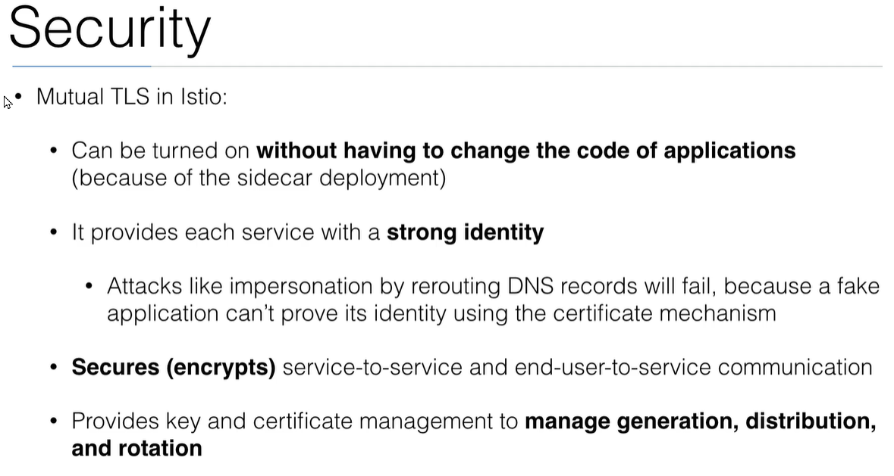

# Learn DevOps: The Complete Kubernetes Course

## Section 10 Microservices

### Ch 120 Introduction istio


```bash
## not working on arm64 : FAIL
 curl -L https://istio.io/downloadIstio | ISTIO_VERSION=1.9.1 TARGET_ARCH=arm64 sh -
 sudo ./istio-1.9.1/bin/istioctl install --set profile=demo -y --kubeconfig /etc/rancher/k3s/k3s.yaml
```

```bash
## on docker desktop wsl2
curl -L https://istio.io/downloadIstio | sh -
istio-1.9.1/bin/istioctl install --set profile=demo -y
kubectl label namespace istio-tests istio-injection=enabled
kubectl apply -f samples/bookinfo/platform/kube/bookinfo.yaml -n istio-tests
kubectl get services -n istio-tests
kubectl get pods -n istio-tests

kubectl exec "$(kubectl get pod -l app=ratings -o jsonpath='{.items[0].metadata.name}' -n istio-tests)" -c ratings -n istio-tests -- curl -sS productpage:9080/productpage  | grep -o "<title>.*</title>"

kubectl apply -f samples/bookinfo/networking/bookinfo-gateway.yaml -n istio-tests

istioctl analyze -n istio-tests

kubectl get po -l istio=ingressgateway -n istio-system -o jsonpath='{.items[0].status.hostIP}'
//192.168.65.3
kubectl -n istio-system get service istio-ingressgateway -o jsonpath='{.spec.ports[?(@.name=="http2")].nodePort}'
//30498

curl -vvvv http://kubernetes.docker.internal/productpage
kubectl delete -f samples/bookinfo/platform/kube/bookinfo.yaml -n istio-tests

//build http-echo
docker build -t ericsoucy/http-echo .
docker run  -e TEXT=hello -p 8080:8080 ericsoucy/http-echo
docker push ericsoucy/http-echo
```

### Ch 122 Demo: An Istio enabled app

```bash
wget https://raw.githubusercontent.com/ericsoucy/learn-devops-the-complete-kubernetes-course-Section10Microservices/main/istio/helloworld.yaml

kubectl apply -f <(./istio-1.9.1/bin/istioctl kube-inject -f helloworld.yaml -n istio-tests) -n istio-tests
kubectl get pods -n istio-tests

kubectl apply -f https://raw.githubusercontent.com/ericsoucy/learn-devops-the-complete-kubernetes-course-Section10Microservices/main/istio/helloworld-gw.yaml -n istio-tests

curl -vvvv http://kubernetes.docker.internal/hello
```

### ch 123 Demo: Advanced routing with Istio


```bash
wget https://raw.githubusercontent.com/ericsoucy/learn-devops-the-complete-kubernetes-course-Section10Microservices/main/istio/helloworld-v2.yaml

kubectl apply -f <(./istio-1.9.1/bin/istioctl kube-inject -f helloworld-v2.yaml -n istio-tests) -n istio-tests
kubectl get pods -n istio-tests

kubectl apply -f helloworld-v2-routing.yaml -n istio-tests

curl -vvvv  -H "host: hello.example.com" http://kubernetes.docker.internal/hello

curl -vvvv  -H "host: hello.example.com" -H "end-user: john" http://kubernetes.docker.internal/hello

```

### ch 124. Demo: Canary Deployments


```bash
kubectl apply -f helloworld-v2-canary.yaml -n istio-tests

kubectl describe virtualservice helloworld -n istio-tests

for ((i=1;i<=10;i++)); do curl -H "host: hello.example.com" http://kubernetes.docker.internal/hello; done
```

### ch 125. Demo: Retries


```bash
kubectl apply -f helloworld-v3.yaml -n istio-tests

curl -vvvv  -H "host: hello-v3.example.com" http://kubernetes.docker.internal/hello

for ((i=1;i<=10;i++)); do time curl -H "host: hello-v3.example.com" http://kubernetes.docker.internal/hello; done


// comment retries
kubectl apply -f helloworld-v3.yaml -n istio-tests

```

### ch 126. Mutual TLS

<https://istio.io/latest/docs/concepts/security/#mutual-tls-authentication>





```bash
wget https://raw.githubusercontent.com/ericsoucy/learn-devops-the-complete-kubernetes-course-Section10Microservices/main/istio/helloworld-tls.yaml


kubectl apply -f <(./istio-1.9.1/bin/istioctl kube-inject -f helloworld-tls.yaml)
kubectl apply -f helloworld-tls-legacy.yaml

kubectl get svc -o wide -n istio-system

//debug
kubectl get destinationrules.networking.istio.io --all-namespaces
kubectl get virtualservices.networking.istio.io --all-namespaces 

curl -vvvv  -H "host: hello-tls.example.com" http://kubernetes.docker.internal/
```

SEE:
<https://istio.io/latest/docs/tasks/security/authentication/authn-policy/>
<https://istio.io/latest/docs/tasks/security/authentication/mtls-migration/>

### 128. RBAC with Istio && 129. Demo: RBAC with Istio

RBAC (deprecated)
<https://istio.io/v1.4/docs/reference/config/security/istio.rbac.v1alpha1/>

v1beta1 Authorization policy
<https://istio.io/latest/docs/concepts/security/#authorization-policies>
<https://istio.io/latest/docs/tasks/security/authorization/authz-http/>

### 130  End-user authentication with istio (JWT) && 131. Demo: End-user authentication with istio (JWT)

<https://istio.io/latest/docs/tasks/security/authentication/authn-policy/#end-user-authentication>

### 132 Demo: Istio Egress traffic

<https://istio.io/latest/docs/tasks/traffic-management/egress/egress-control/>
<https://istio.io/docs/tasks/traffic-management/egress/egress-control/>

```bash
kubectl apply -f <(istioctl kube-inject -f ./istio/helloworld.yaml)
kubectl exec -it hello-8c7bddb77-5qdjr -- sh
   wget world-2:8080
   cat index.html
   wget ifconfig.co
   To enable  restriction

kubectl get configmap istio -n istio-system -o yaml | sed 's/mode: ALLOW_ANY/mode: REGISTRY_ONLY/g' | kubectl replace -n istio-system -f -
```

### 133. Demo: Distributed Tracing with Jaeger

<https://istio.io/latest/docs/tasks/observability/distributed-tracing/jaeger/>

```bash
kubectl apply -f istio-1.9.1/samples/addons/jaeger.yaml
istioctl dashboard jaeger
http://localhost:16686
// generate some traffic
```


### 134. Istio's Grafana Metrics

<https://istio.io/latest/docs/tasks/observability/metrics/using-istio-dashboard/>

```bash
 kubectl apply -f istio-1.9.1/samples/addons/grafana.yaml
 kubectl apply -f istio-1.9.1/samples/addons/prometheus.yaml
 istioctl dashboard grafana

```
